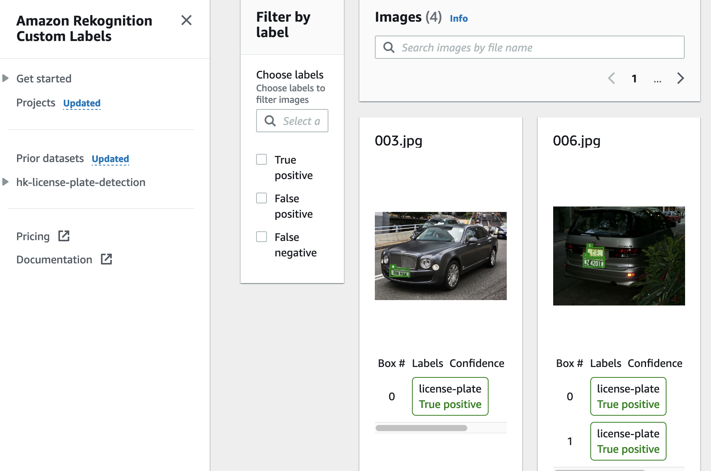
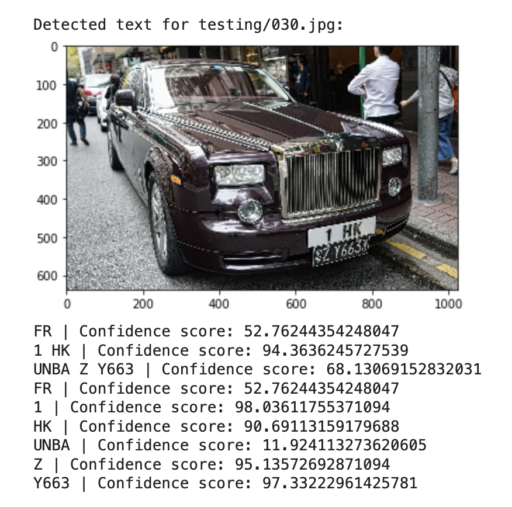
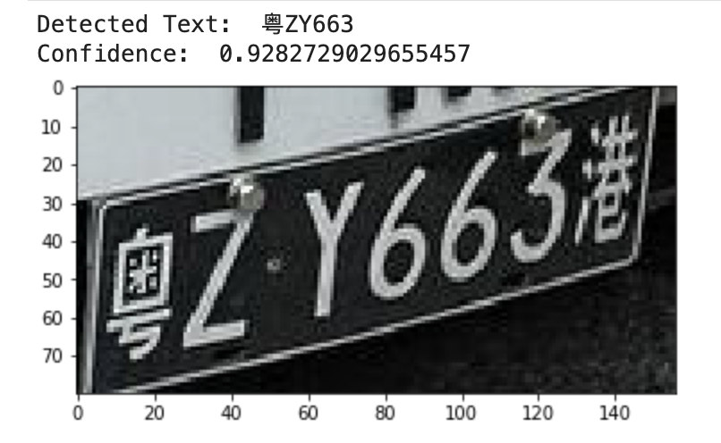

# Detect and recognize license plates in Hong Kong using Amazon Rekognition & PaddleOCR

## Solution Overview

The sample notebooks provided here may help you in deploying an OCR solution to capture license plate values more accurately in production environment where cameras usually capture objects more than just the license plates alone, that you may need to first process the images such as cropping the images.

To intelligently crop the license plate portion out from an image, you may deploy tools like [Amazon Rekognitoin Custom Labels](https://aws.amazon.com/rekognition/custom-labels-features/) which would be covered in the sample notebooks.

In addition, leveraging open source OCR model like [PaddleOCR](https://github.com/PaddlePaddle/PaddleOCR) can help in addressing the challenge of capturing license plate values that include multi-lingual text.

As a reference, the sample notebooks deployed here are used to test against license plates in Hong Kong where license plates may include both Chinese characters and alphabetical values.

To get started, you may visit the sample notebook [here](detect_and_recognize_license_plates_in_hk_using_rekognition_and_paddleocr.ipynb)

## OCR Results Comparison

1. Using OCR solution such as Amazon Rekognition [detect_text](https://docs.aws.amazon.com/rekognition/latest/dg/text-detection.html) without any image processing:

2. Cropped license plate images by Amazon Rekognition [Custom Labels](https://docs.aws.amazon.com/rekognition/latest/customlabels-dg/what-is.html) feature, then processed with [PaddleOCR](https://github.com/PaddlePaddle/PaddleOCR):

## Testing & Training Image Sources
Images being used in this repository were results searched from [Google](https://www.google.com/search?q=hk%20license%20plate&tbm=isch&tbs=il:ol&hl=zh-TW&sa=X&ved=0CAAQ1vwEahcKEwig9Nq4wZ_3AhUAAAAAHQAAAAAQAg&biw=1425&bih=775) and filtered with "Usage rights" as "Commercial & other licenses".